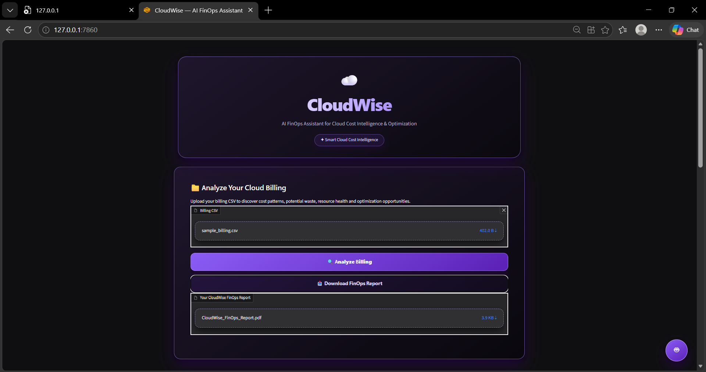
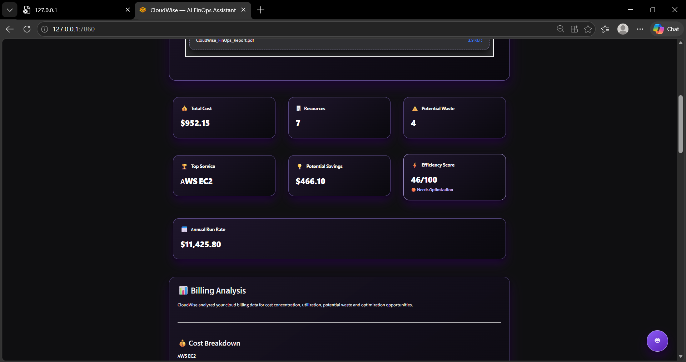
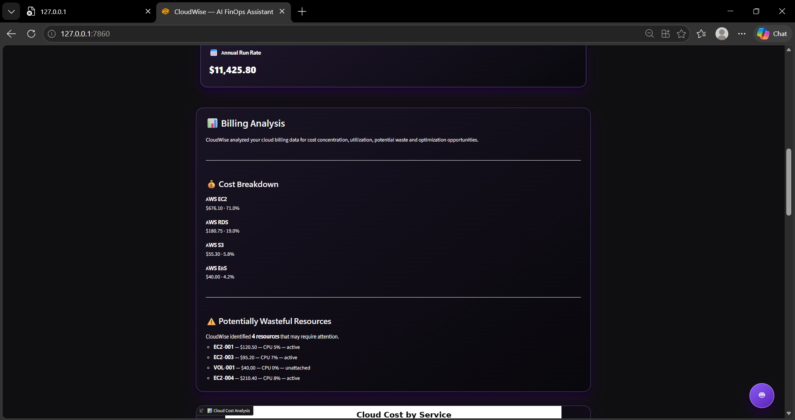
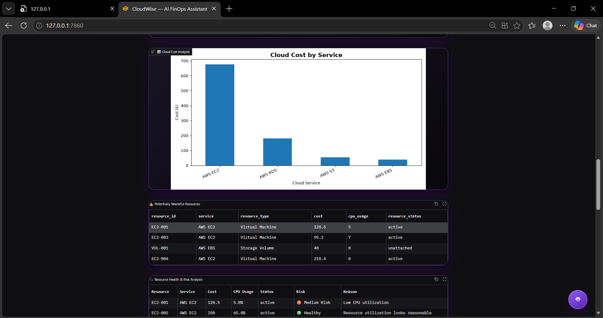
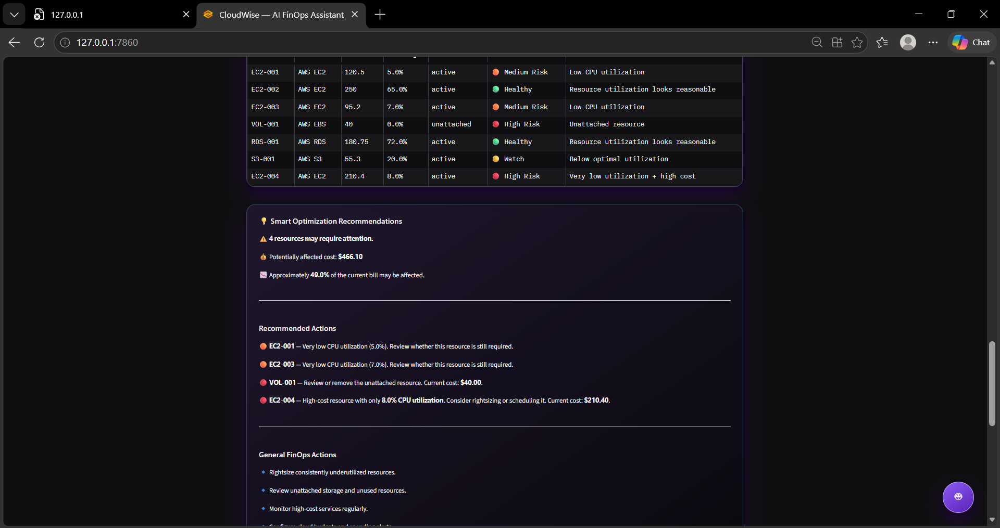
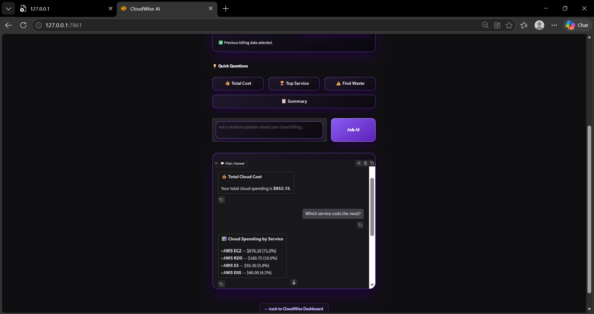

# ☁️ CloudWise — AI FinOps Assistant

> **AI-powered cloud cost intelligence, resource health analysis, and optimization assistant**

CloudWise is an AI FinOps Assistant designed to help cloud users understand their cloud resource usage, identify potentially unnecessary or inefficient resource consumption, and discover optimization opportunities.

It analyzes cloud billing data from a CSV file and provides cost breakdowns, potential waste detection, resource health analysis, efficiency scoring, optimization recommendations, cost projections, PDF reports, and an AI-powered chat assistant.

---

## 🎯 Problem Statement

Cloud users often find it difficult to understand their cloud resource usage and identify possible areas of unnecessary or inefficient resource consumption.

CloudWise addresses this problem by analyzing cloud billing and resource-utilization data and presenting meaningful insights in an easy-to-understand dashboard.

### Our approach

**Cloud Billing Data → Analyze Usage → Detect Inefficiency → Explain the Problem → Recommend Optimization → Estimate Potential Savings**

---

## 💡 Project Overview

CloudWise is a local AI FinOps dashboard that transforms cloud billing data into actionable insights.

Users can upload a cloud billing CSV file and immediately view:

* 💰 Total cloud cost
* 🏆 Highest-cost cloud service
* ⚠️ Potentially wasteful resources
* 💡 Potential savings
* ⚡ Cloud efficiency score
* 📅 Annual run-rate projection
* 🩺 Resource health and risk analysis
* 📊 Cloud cost visualization
* 💡 Smart optimization recommendations
* 🧠 Executive FinOps summary
* 📄 Downloadable FinOps PDF report
* 🤖 AI-powered cloud billing assistant

The project is designed to demonstrate how FinOps principles and AI-assisted analysis can help organizations make better cloud-cost decisions.

---

## ✨ Key Features

### 1. 📊 Cloud Billing Analysis

Upload a CSV billing file and CloudWise analyzes the cloud spending automatically.

The dashboard provides:

* Total cost
* Number of resources
* Top cloud service
* Potentially wasteful resources
* Potential savings

---

### 2. ⚡ Cloud Efficiency Score

CloudWise calculates an efficiency score based on resource utilization and potentially wasteful resources.

The score helps users quickly understand whether their current cloud spending appears efficient or requires optimization.

---

### 3. 🩺 Resource Health & Risk Analysis

Each cloud resource is analyzed based on:

* CPU utilization
* Resource status
* Cost
* Potential inefficiency

Resources are categorized into:

* 🟢 Healthy
* 🟡 Watch
* 🟠 Medium Risk
* 🔴 High Risk

---

### 4. 💡 Smart Optimization Recommendations

CloudWise generates resource-specific recommendations.

Examples include:

* Reviewing low-utilization resources
* Rightsizing expensive resources
* Reviewing unattached storage
* Scheduling underutilized resources
* Monitoring high-cost services
* Setting cloud budgets and spending alerts

> ⚠️ Potential savings shown by CloudWise are estimates and are not guaranteed savings.

---

### 5. 📈 Cloud Cost Visualization

The dashboard provides a visual comparison of cloud spending across services.

This helps users quickly identify which services contribute most to their cloud bill.

---

### 6. 📅 Annual Run-Rate Projection

CloudWise can calculate an estimated annual run rate from the uploaded billing amount.

For example:

**Monthly Cost × 12 = Estimated Annual Run Rate**

> This is a simple projection and not a historical forecast. Actual future spending may differ.

---

### 7. 🤖 CloudWise AI Assistant

CloudWise includes a separate AI assistant interface where users can ask questions about their billing data.

Users can:

* Select previous billing data
* Upload new billing data
* Ask quick questions
* Ask custom questions
* View AI-generated answers

Example questions:

* "What is my total cloud cost?"
* "Which service costs the most?"
* "Find wasteful resources."
* "How much can I potentially save?"
* "Give me a summary."
* "Show my cloud spending by service."

---

### 8. 📄 FinOps PDF Report

CloudWise can generate a downloadable FinOps report containing important billing and optimization information.

The report can be used for:

* Project demonstrations
* Cost reviews
* Documentation
* Presentation
* FinOps analysis

---

## 🖥️ Screenshots

### CloudWise Dashboard



---

### CloudWise Overall Analysis



---

### Billing Analysis



---

### Cloud Cost Chart & Resource Risk Analysis



---

### Smart Optimization Recommendations



---

### CloudWise AI Assistant



---
## 🎥 Demo Video

Click below to watch the CloudWise demo:

[▶️ Watch CloudWise Demo](https://drive.google.com/file/d/1lchftKL25WX7-FgkxeM0D4EJ80BNHroK/view?usp=drive_link)


## 🛠️ Technologies Used

### Programming Languages

* Python
* HTML
* CSS
* JavaScript

### Python Libraries & Frameworks

* Gradio
* Pandas
* Matplotlib
* FastAPI
* Uvicorn
* ReportLab

### Data

* CSV-based cloud billing data

### Development Tools

* Visual Studio Code
* Git
* GitHub

---

## 📁 Project Structure

```text
Cloudwise/
│
├── backend/
│   ├── chat_engine.py
│   └── sample_billing.csv
│
├── frontend/
│   ├── app.py
│   ├── chat.py
│   └── pdf_report.py
│
├── data/
│   └── previous_billing.csv
│
├── screenshots/
│   ├── 01-dashboard.png
│   ├── 02-overall-analysis.png
│   ├── 03-billing-analysis.png
│   ├── 04-cost-chart-and-risk.png
│   ├── 05-optimization-recommendations.png
│   └── 06-ai-assistant.png
│
├── hello.py
├── Run_CloudWise.bat
└── README.md
```

---

## ⚙️ Setup & Installation

### Step 1 — Clone the Repository

```bash
git clone YOUR_GITHUB_REPOSITORY_LINK
```

Then enter the project directory:

```bash
cd Cloudwise
```

---

### Step 2 — Install Required Packages

Open PowerShell or the VS Code terminal and run:

```bash
python -m pip install pandas gradio matplotlib fastapi uvicorn reportlab
```

---

## ▶️ How to Run CloudWise

CloudWise uses two separate interfaces:

* **Dashboard:** Port `7860`
* **AI Assistant:** Port `7861`

### Terminal 1 — Start the Dashboard

Run:

```bash
python frontend\app.py
```

Open:

```text
http://127.0.0.1:7860
```

---

### Terminal 2 — Start the AI Assistant

Open another VS Code terminal and run:

```bash
python frontend\chat.py
```

Open:

```text
http://127.0.0.1:7861
```

Both terminals should remain running while using the complete application.

---

## 📄 Sample Billing Data

A sample billing dataset is included in:

```text
backend/sample_billing.csv
```

The dataset contains information such as:

* Resource ID
* Cloud service
* Resource type
* Cost
* CPU utilization
* Resource status

You can upload this file directly into the CloudWise dashboard to test the application.

---

## 🔄 Application Workflow

```text
        Cloud Billing CSV
                │
                ▼
        ┌─────────────────┐
        │ CloudWise       │
        │ Billing Analysis│
        └────────┬────────┘
                 │
       ┌─────────┼─────────┐
       ▼         ▼         ▼
   Cost      Resource    Usage
 Analysis     Health    Analysis
       │         │         │
       └─────────┼─────────┘
                 ▼
       Potential Waste Detection
                 │
                 ▼
       Optimization Recommendations
                 │
        ┌────────┴────────┐
        ▼                 ▼
 Potential Savings     FinOps Report
        │
        ▼
   AI Assistant
```

---

## 🎥 Demo Video

A **2–5 minute demonstration video** will be added here for the project submission.

### Demo should demonstrate:

1. Opening the CloudWise dashboard
2. Uploading the billing CSV
3. Clicking **Analyze Billing**
4. Showing total cloud cost
5. Showing potential waste
6. Showing the efficiency score
7. Showing resource health and risk analysis
8. Showing optimization recommendations
9. Opening the CloudWise AI Assistant
10. Asking a billing-related question
11. Generating the FinOps PDF report

**Demo Video:** `Add your video link here`

---

## 🚀 Future Improvements

Possible future enhancements include:

* Integration with AWS billing APIs
* Integration with Microsoft Azure billing
* Integration with Google Cloud billing
* Real-time cloud monitoring
* Advanced historical cost forecasting
* Automated anomaly detection
* More advanced AI-powered recommendations
* Cloud budget alerts
* Multi-user dashboards
* Database integration
* Production deployment

---

## 🎯 Project Objective

The main objective of CloudWise is to make cloud cost management easier to understand by converting raw billing and utilization data into meaningful FinOps insights.

CloudWise helps users answer questions such as:

> **Where is my cloud money being spent?**

> **Which resources may be inefficient?**

> **Which resources require attention?**

> **Where could I potentially reduce cloud spending?**

---

## 👥 Team Project

**Project:** CloudWise — AI FinOps Assistant

**Domain:** Cloud Computing / AI / FinOps

**Purpose:** Cloud Cost Intelligence and Optimization

---

## ⚠️ Disclaimer

CloudWise provides analytical insights and estimated potential savings based on the uploaded billing and utilization data.

Recommendations and potential savings are **estimates only**. Actual cloud costs and savings may vary depending on workload requirements, pricing models, usage patterns, and cloud-provider policies.

---

## 📜 License

This project was developed as an academic/team project.
